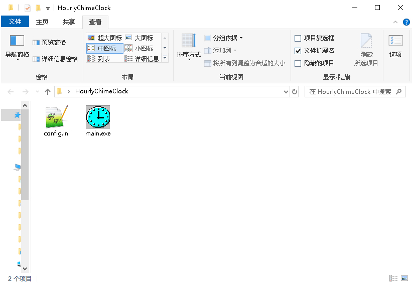
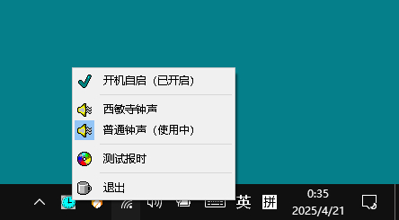

# HourlyChimeClock
- 一个Windows下的极简整点报时软件，使用内置语音，非TTS，以提升报时音色和稳定性。

## 开发背景
- windows系统下，需要一个整点报时的程序，便于平时工作时，提醒自己，不要工作太久，适当休息一下；
- 不打算使用windows系统本地TTS语音合成，音色不自然，听感体验不是很好；
- 软件单机离线运行，不喜欢那种偷偷联网的程序，不简洁，不纯粹，不安全；
- 软件为绿色版，无需安装，无文件残留，可以设置为开机自启，使用、删除都方便；
- 因为只需要整点报时，所以提前在线使用AI TTS Maker生成了24个报时的语音文件（wav格式，对应一天的24小时）；
- 总体风格，类似老式的整点语音报时挂钟，每到整点，就会播放一段钟声，然后播放当前整点报时。

## 功能介绍
- 软件为绿色版exe文件（main.exe），单击后直接运行；

- 软件无主界面，运行后，直接出现在系统的托盘中；
- 在托盘图标上右键，即可弹出功能菜单，可以开启/关闭开机自启，可以选择报时钟声，可以测试报时；

- 注意，测试报时功能，只能播放整点报时，未必符合当前的时间，仅仅用于试听检查报时的声音；
- 软件后台运行，每到整点就会报时，默认报时早7点-晚10点，如果要调整报时时间范围，可以手动修改congfig.ini文件：
	- starthour = 7	# 开始报时时间
	- endhour = 22	# 结束报时时间
	
## 其它事项说明（针对开发者）
- 软件使用python + PyQt5（界面库） + pygame（声音播放库）开发；
- 软件一直在后台运行，不会弹出任何窗口、通知干扰工作，只会在整点进行语音报时；
- 软件为单实例程序，不会启动多个程序实例，目的为避免冲突；
- 软件后台内存占用 <15MB；
- 软件后台CPU占用 <<1%；
- 软件已在win7系统、win10系统下测试，长期稳定运行；
- 如果把Windows当服务器使用，需要注意，只有在登录Windows系统后， 软件才能保持一直在后台运行，如果注销退出Windows系统，则软件会停止工作。

## 软件存在的不足和后续改进方向
1. 目前的软件功能比较简单，本着“先用起来”的原则，发布了v1.0版，后续如果时间允许，会继续对报时软件的功能细节进行打磨，并优化代码和架构；
2. 软件采用普通架构，未采用CS架构，存在的问题就是：软件只能在用户登录Windows系统后才运行，不能在注销状态下运行，这是图形界面软件的局限。如果希望软件在Windows注销状态下也能运行，就需要把报时程序做成系统Service服务。其典型的使用场景，就是家中有一台Windows服务器（WinNAS或者客厅HPC，部署了我们的整点报时程序），而我们经常需要通过RDP远程桌面连接到Windows服务器进行配置管理，此时就会导致Windows服务器处于注销未登录状态，间接导致报时程序停止运行。

## python源码的打包命令（方便开发者自行打包exe）
- 软件使用pyinstall打包；
- 打包命令如下：pyinstaller --noconsole --onefile --add-data "src-icon;src-icon" --add-data "src-sound;src-sound" --icon=src-icon/tray_icon.ico --distpath release main.py
